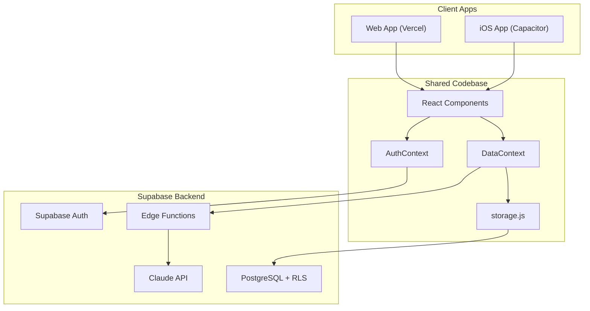

# PuppyBot iOS App Roadmap

## The Core Question: How Much Work Is This?

**Short answer:** Moderate. Because your backend is already Supabase (cloud-hosted), both web and iOS would talk to the exact same database, auth system, and Edge Functions. The data layer is already "seamless" — the work is about packaging the frontend for iOS and adding native capabilities.

---

## Recommended Approach: Capacitor

There are four ways to get PuppyBot on iOS:

| Approach | Code Reuse | Effort | Native Feel | App Store |
|----------|-----------|--------|-------------|-----------|
| **Capacitor** | ~95% shared | Low | Good | Yes |
| React Native | ~30% shared (logic only) | High | Excellent | Yes |
| Swift/SwiftUI | 0% shared | Very High | Best | Yes |
| PWA only | 100% shared | Very Low | Limited | No |

**Capacitor is the clear winner** for your situation because:

- It wraps your **existing React + Vite app** in a native iOS WebView — your entire codebase stays as-is
- One codebase, two platforms (web + iOS), same Supabase backend
- You get App Store distribution + native APIs (push notifications, camera, haptics)
- The UI is already mobile-first and touch-optimized — users won't notice the difference
- Adding Capacitor to an existing Vite project takes about 30 minutes for the initial setup

---

## What Already Works (Zero Changes Needed)

These parts of PuppyBot carry over to iOS with no modification:

- **All Supabase data sync** — same database, same auth, same Edge Functions
- **All pages** — Dashboard, History, Stats, Profile, Health Tracker
- **All forms** — Potty, Meal, Nap, WakeUp, SkillsNotes
- **AI Chat Assistant** — same Edge Function, same UI
- **Charts and visualizations** — Recharts renders identically in WebView
- **PDF export** — jsPDF works in WebView
- **Auth flow** — Supabase Auth works natively with Capacitor
- **Family sharing** — all server-side, works as-is
- **Role-based access** — DataContext logic unchanged
- **Bottom navigation** — already styled for mobile

---

## What Needs to Change

### Layer 1: Project Setup (1-2 days)

Install Capacitor and configure the iOS project:

- Add `@capacitor/core`, `@capacitor/cli`, `@capacitor/ios` to `package.json`
- Create `capacitor.config.ts` pointing to Vite's `dist/` build output
- Generate the Xcode project via `npx cap add ios`
- Configure `vite.config.js` to output to Capacitor's expected directory
- Set up the iOS bundle identifier (e.g., `ai.puppybot.app`)

### Layer 2: Native Adaptations (3-5 days)

Small code changes to make the app feel native on iOS:

**Safe Areas and Status Bar**

- The app already handles bottom safe areas in `src/components/BottomNav.jsx` via `env(safe-area-inset-bottom)`, but the **top safe area** (notch/Dynamic Island) needs attention in the header (`src/App.jsx`)
- Add `viewport-fit=cover` to `index.html` meta viewport tag
- Use `@capacitor/status-bar` plugin to control status bar appearance

**Navigation**

- Add iOS swipe-back gesture support (Capacitor provides this, but may need CSS tweaks to avoid conflicts)
- Handle hardware back button behavior

**Platform Detection**

- Create a small `usePlatform()` hook that detects web vs. iOS via `Capacitor.isNativePlatform()`
- Use it to conditionally show/hide web-only features (e.g., the browser speech recognition in `src/components/DashboardChat.jsx` may need swapping to a native speech plugin)

**Keyboard Handling**

- The chat input in `src/components/DashboardChat.jsx` needs `@capacitor/keyboard` plugin to handle iOS keyboard push-up behavior and avoid input fields being hidden

### Layer 3: Native Features (5-8 days)

Features that benefit from native APIs (optional but recommended):

**Push Notifications**

- Add `@capacitor/push-notifications` plugin
- Create a Supabase Edge Function to send push via APNs
- Store device tokens in a new `device_tokens` table
- Wire up notifications for: shared puppy updates, reminders, AI weekly insights

**Camera Integration**

- Add `@capacitor/camera` plugin
- Enhance puppy photo upload in `src/pages/PuppyProfile.jsx` to use native camera/photo picker instead of file input
- Better photo quality and UX than web file picker

**Haptic Feedback**

- Add `@capacitor/haptics` plugin
- Add subtle haptic feedback to quick-add buttons on Dashboard

**Biometric Auth**

- Add a biometric unlock option (Face ID / Touch ID) as an alternative to email/password login
- Enhances security and convenience

**App Icon and Splash Screen**

- Design app icon (use existing PawPrint + steel-blue theme)
- Create splash screen matching the current loading state in `src/App.jsx`
- Generate all required iOS icon sizes (1024x1024 source)

### Layer 4: App Store Preparation (2-3 days)

- Apple Developer Account ($99/year)
- App Store Connect setup (screenshots, description, privacy policy)
- Privacy nutrition labels (Supabase collects email; app collects health data about pets)
- TestFlight beta distribution setup
- App review guidelines compliance check
- Create privacy policy page on puppybot.ai

### Layer 5: PWA as Interim Step (1 day, optional)

Before or alongside the native app, adding PWA support to the web version is a quick win:

- Add `manifest.json` to `public/` with app name, icons, theme color
- Add `vite-plugin-pwa` to `vite.config.js` for service worker generation
- This lets users "Add to Home Screen" on iOS Safari immediately
- Not a replacement for a native app, but gives an app-like experience today

---

## Architecture: How Seamlessness Works

The key insight: **both apps run the exact same React code and talk to the exact same Supabase backend**. A user can log a potty break on the website, switch to the iOS app, and see it instantly. There is no sync logic to build — Supabase handles it all.

---

## Files That Need Changes

| File | Change | Effort |
|------|--------|--------|
| `package.json` | Add Capacitor dependencies | Trivial |
| `capacitor.config.ts` | New file — Capacitor configuration | Small |
| `vite.config.js` | Minor build output path tweak | Trivial |
| `index.html` | Add `viewport-fit=cover`, PWA meta tags | Trivial |
| `src/App.jsx` | Top safe area padding, platform detection | Small |
| `src/components/BottomNav.jsx` | Already handles safe areas — may need minor tweaks | Trivial |
| `src/components/DashboardChat.jsx` | Swap Web Speech API for native speech on iOS | Medium |
| `src/pages/PuppyProfile.jsx` | Native camera for photo upload | Small |
| `src/context/AuthContext.jsx` | Add biometric auth option | Medium |
| New: `src/hooks/usePlatform.js` | Platform detection hook | Small |
| New: `src/utils/notifications.js` | Push notification registration | Medium |
| New: `ios/` directory | Auto-generated Xcode project | Auto |

**Estimated total lines of code changed/added: ~200-400 lines** (excluding auto-generated iOS project files).

---

## Effort Summary

| Phase | Time Estimate | Complexity |
|-------|--------------|------------|
| Layer 1: Project Setup | 1-2 days | Low |
| Layer 2: Native Adaptations | 3-5 days | Low-Medium |
| Layer 3: Native Features | 5-8 days | Medium |
| Layer 4: App Store Prep | 2-3 days | Low (but bureaucratic) |
| Layer 5: PWA (optional) | 1 day | Low |
| **Total** | **12-19 days** | |

This assumes one developer working on it. Layers 1-2 get you a functional iOS app. Layers 3-4 make it feel polished and get it in the App Store.

---

## Ongoing Maintenance

Once live, maintaining both platforms adds minimal overhead:

- **Code changes**: 95% of changes are to shared React code — they apply to both platforms automatically
- **Build pipeline**: `npm run build && npx cap sync ios` before each iOS release
- **iOS updates**: Occasional Capacitor plugin updates, Xcode version bumps
- **App Store**: Review process for each update (typically 24-48 hours)

---

## Recommended Execution Order

1. **Start with PWA** (1 day) — immediate value, lets users test "app-like" experience today
2. **Add Capacitor + basic iOS build** (2-3 days) — get the app running in Xcode simulator
3. **TestFlight beta** (1-2 days) — distribute to yourself and testers
4. **Native enhancements** (5-8 days) — push notifications, camera, haptics
5. **App Store submission** (2-3 days) — screenshots, metadata, review

---

**Last Updated**: February 2026
